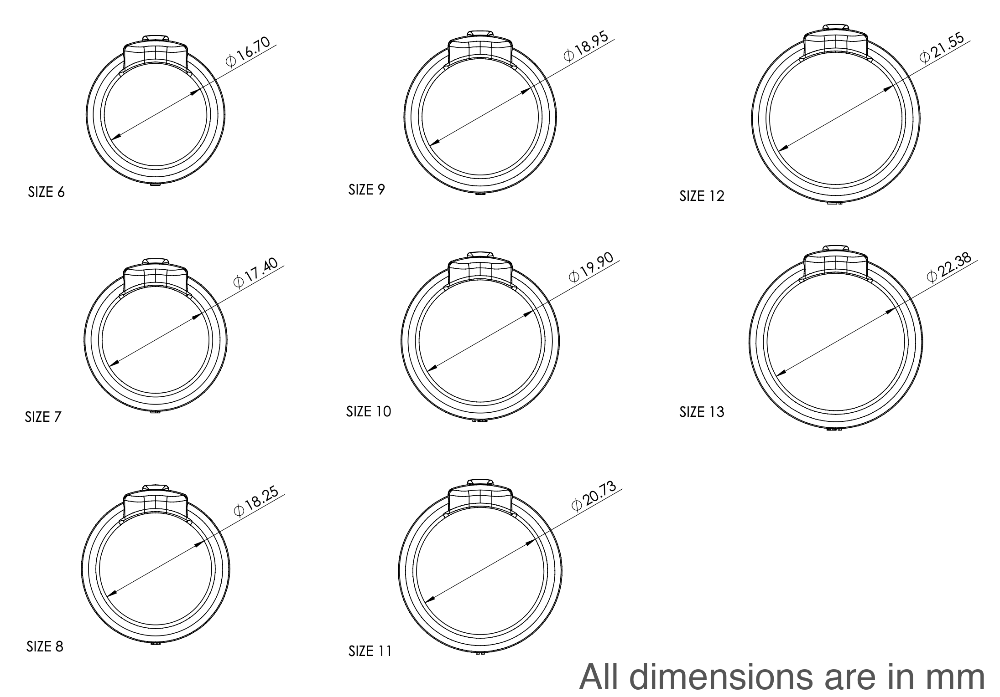

# Pebble Index 01 — How to measure your finger and find the right size

Index 01 sits on your index finger. It fits differently than any other ring you've worn — different shape, different weight, different feel. Your usual ring size won't translate directly.

**You need to size your finger specifically for Index 01.**

Sizer kits from other companies (Oura, Amazon, etc.) won't give you an accurate fit.

## Sizes available

Index 01 is currently available in sizes 6–13.

## How to get the sizing kit

Pick whichever works best for you:

1. **3D print the ring sizer** — Download `20260222-index-01-ring-sizer-FDM-v1.STL` and print it. We've tested it on a Bambu H2C but it should work well on any FDM 3D printer. 
    
    **Please note**: the rings in this file are connected to each other for ease of printing, so you will need to clip the connectors before trying on. These rings are also 'flattened' to not require printing with supports. The real Index 01 will not be flattened like this, of course. If you'd like to print individual sizes rather than all sizes, you can find them in `individual_ring_stls/`.

2. **Order an Index 01 Ring Sizer Kit** from Pebble (available soon).
3. **Visit a jeweler** and have them measure the diameter index finger, then look at the image below and find the right size.

## How do I know which size to pick?
We recommend printing off the entire set, then experimenting with different sizes on your index finger. You should not force the ring onto your finger. It should feel comfortable. Try wearing it for 24 hours to make sure that you've got the right size. Your fingers actually change in diameter during the day depending on temperature, activity and other factors. 

## After 3D printing

3D prints can vary slightly. You may want to use calipers to measure the inner diameter of your printed ring and compare it against the actual dimensions below.

## Sizes 14 & 15

The ring sizer includes sizes 14 and 15, but we don't offer these yet. If either of these fits you, let us know — we'd love to hear from you:

[Register your interest in size 14/15](https://forms.gle/fgZxy7Vn7tL8bQER7)

